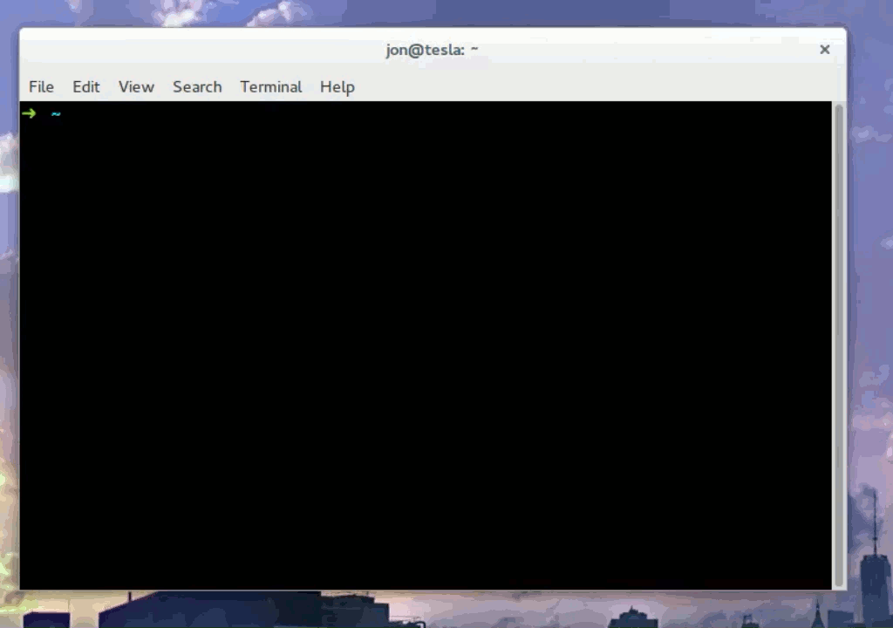

Enabling Automatic Installation
===============================

To get a drupal environment to fully instantiate and enable, you must add to .terra.yml's hooks.

The app located at https://github.com/jonpugh/drupal-terra will be installed automatically upon environment enabling.

See https://github.com/jonpugh/drupal-terra/blob/master/.terra.yml for an example on how to get your app to 
install automatically.

You can watch this app have an environment created here: https://www.youtube.com/watch?v=nNvTiEUXqFE



Setting up a Drupal Site
========================

How to get a drupal site running on Terra:

1. Install Terra
2. Add your first "app" using the `terra app:add` command.

    ```sh
    you@localhost:~$ terra app:add 
    System name of your project? mysite
    Description? A cool site
    Source code repository URL? git@github.com:jonpugh/drupal.git
     Name:        mysite                            
     Description: A cool site                       
     Repo:        git@github.com:jonpugh/drupal.git 
    App saved
    ```
    
3. Add your first environment using the `terra environment:add` command.

    ```sh
    you@localhost:~$ terra environment:add
    Which app? 
      [0] mysite
    Environment Name: local
    Path: (/home/you/mysite/local)
    Cloning into '/home/jon/mysite/local'...
    * master
    On branch master
    Your branch is up-to-date with 'origin/master'.
    nothing to commit, working directory clean
    Environment saved to registry.
    ```
    
4. Enable your environment using the `terra environment:enable` command.

    ```sh
    terra environment:enable
    Which app? 
      [0] mysite
     > 0
    Which environment? 
      [0] local
     > 0
    DOCKER > Creating mysitelocal_database_1...
    DOCKER > Creating mysitelocal_app_1...
    DOCKER > Creating mysitelocal_drush_1...
    Environment enabled!  Available at http://localhost:32768
    ```

    *Note:* The first time you enable an environment, docker must download all of the images. 
    This will take a few minutes depending on your connection.

5. Visit the URL for the environment.  You will see the Drupal install page.
6. Prepare files folder and settings.php.

    ```sh
    you@localhost:~$ terra environment:add
    you@localhost:~$ cd /home/you/mysite/local/sites/default
    you@localhost:~$ mkdir files
    you@localhost:~$ chmod 777 files
    you@localhost:~$ cp default.settings.php settings.php
    you@localhost:~$ chmod 777 settings.php
    ```
7. Visit the URL for the environment and step through the install process.  
  When you get to the Database credentials page, enter the following credentials:
  
  - Database: drupal
  - Database User: drupal
  - Database Password: drupal
  - Database Host: database
  
  When you hit Submit, the installer should run, and you should get a Drupal site!
   
Makefile Driven Development
===========================

Using Terra's build hooks, you can use makefile for your app.

See the repo at https://github.com/jonpugh/drupal-terra for an example.
