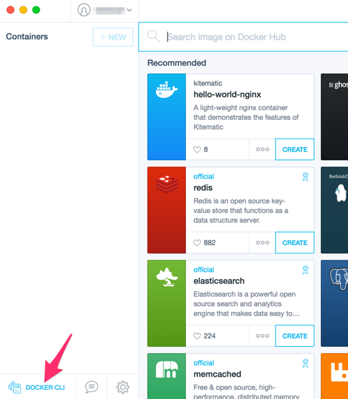
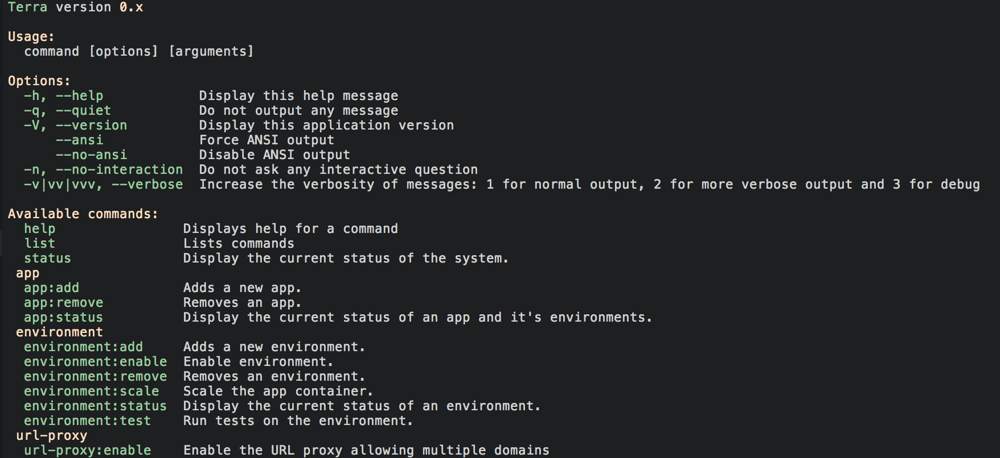

# Installation

Currently there are a few steps to get terra working.  We want installation to be as fast and simple as possible, so we will be working on a single install script that sets up all of the prerequisites. 

## Prerequisites

Terra depends on the following tools.  The instructions below will guide you through setting up all of them.

- PHP
- git
- Composer [http://getcomposer.org](http://getcomposer.org)
- Docker [http://docker.com](http://docker.com)
- Docker Compose [https://docs.docker.com/compose](https://docs.docker.com/compose)

## Ubuntu 

Terra recommends Ubuntu Trusty (14.04 or higher).

Run all of the following commands as root, or with `sudo`.

1. Install PHP & Git:

        apt-get update
        apt-get install php5-cli git

2. Install Composer:  
  
  From https://getcomposer.org/doc/00-intro.md#installation-linux-unix-osx
  
        curl -sS https://getcomposer.org/installer | php -- --install-dir=/usr/local/bin --filename=composer

  This will install the composer.phar file at /usr/local/bin/composer.
  
3. Install Docker:

  From https://docs.docker.com/installation/ubuntulinux

        wget -qO- https://get.docker.com/ | sh
        
4. Add your user to the `docker` group:

        usermod -aG docker your-user

  The docker installer will remind you of this at the end.

5. Install Docker Compose:

  From https://docs.docker.com/compose/install/
  
        curl -L https://github.com/docker/compose/releases/download/1.2.0/docker-compose-`uname -s`-`uname -m` > /usr/local/bin/docker-compose
        chmod +x /usr/local/bin/docker-compose

6. Install Drush:

  Drush is used to connect to your running drupal sites.  This step is not required.

  From http://docs.drush.org/en/master/install/
  
        git clone https://github.com/drush-ops/drush.git /usr/share/drush --branch=7.x
        cd /usr/share/drush
        composer install
        ln -s /usr/share/drush/drush /usr/local/bin/drush

6. Install Terra:

  Currently, the `composer global-install` method is not working. See https://github.com/terra-ops/terra-app/issues/25
  
  To install terra manually:
  
        git clone https://github.com/terra-ops/terra-app.git /usr/share/terra
        cd /usr/share/terra
        composer install
        ln -s /usr/share/terra/bin/terra /usr/local/bin/terra

7. Generate an SSH key:

  To connect to your drupal sites via drush, your terra user must have an SSH public key.
  
  To generate one:
  
         ssh-keygen -t rsa -N "" -f ~/.ssh/id_rsa
  

7. Switch back to your user and run `terra` to see if it works!
        
## OSX

Running docker in OSx requires a slightly different setup.

1. Install PHP & Git:

  Install the command line developer tools by installing XCode

2. Install composer:

  From https://getcomposer.org/doc/00-intro.md#installation-linux-unix-osx
  
        curl -sS https://getcomposer.org/installer | php -- --install-dir=/usr/local/bin --filename=composer

3. Install docker & docker-compose:

  The easiest way to get up and running on OSX with Docker is to use [Kitematic](http://kitematic.com). Kitematic will handle all prerequisites.

  After installing Kitematic, you're going to want to use the Docker CLI it makes available to execute docker commands:

  

6. Install Terra:

  Currently, the `composer global-install` method is not working. See https://github.com/terra-ops/terra-app/issues/25
  
  To install terra manually:
  
        git clone https://github.com/terra-ops/terra-app.git /usr/share/terra
        cd /usr/share/terra
        composer install
        ln -s /usr/share/terra/bin/terra /usr/local/bin/terra

## Windows

- [https://getcomposer.org/doc/00-intro.md#installation-windows](https://getcomposer.org/doc/00-intro.md#installation-windows)

  _Note: Windows is currently untested._

## Contributing to Terra

**If you plan on contributing to Terra:**

- Fork [https://github.com/terra-ops/terra-app](https://github.com/terra-ops/terra-app)

Then:

    git clone https://github.com/your_username/terra-app.git
    ln -s /path/to/terra-app/terra /usr/local/bin/terra
    cd /path/to/terra-app
    composer install

## That should be it!

Try to run `terra` on the command line and you should see the default output. Remember if you are using Kitematic to use the Docker CLI provided as mentioned above.

Next you should read up on the [containers strategy](containers.md) or jump right in and try [setting up a sample Drupal installation](drupal.md).
